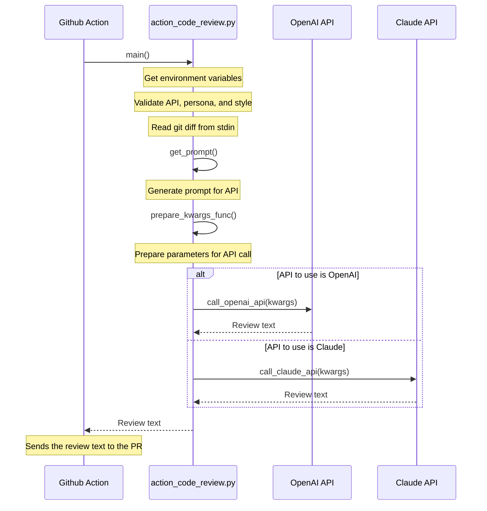
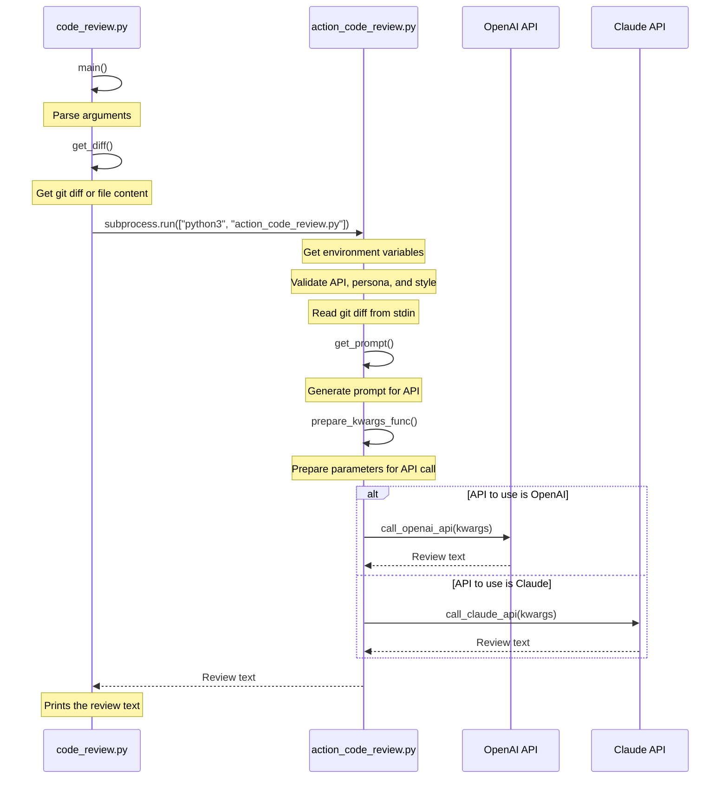

# Code Review Github Action

This action, authored by Frank Chen (@fxchen), improves your pull requests and code base by performing AI-assisted code reviews. It can analyze your pull requests and provide intelligent and insightful comments to help you maintain high code quality.

<details>
  <summary>Diagram for AI code review</summary>
  


</details>

# Setup

## 1. Add a workflow like this in your repo.

Example `.github/workflows/code-review.yml`

```
name: Code review
on: [pull_request]
jobs:
  code-review:
    runs-on: ubuntu-latest
    permissions:
      contents: read
      pull-requests: write
    steps:
      - uses: fxchen/code-review@latest
        with:
          model: 'gpt-3.5-turbo-16k'
          openai-key: ${{ secrets.OPENAI_API_KEY }}
```

## 2. Secret configuration

Configure an OPENAI_API_KEY secret inside your repository settings (Security > Secrets and variables > Actions) . https://github.com/{org}/{repo}/settings/secrets/actions
- Add your OpenAI API key from the API key section (https://platform.openai.com/account/api-keys)


# Inputs

### `openai-key`
This is the OpenAI API key, and it's required for the action to operate.

### `github-token`
The token used to authenticate with the GitHub API. This is not required, as it defaults to the provided GitHub token.

### `model`
The OpenAI language model to use for the code review. This is not required, and defaults to 'gpt-3.5-turbo-16k'.

### `persona`
The persona to use in the prompt. Options include 'developer', 'kent_beck', 'marc_benioff', 'yoda', etc. This is not required, and defaults to 'developer'.

### `style`
The style of output to use. Options include 'concise', 'zen', etc. This is not required, and defaults to 'concise'.

### `include-full-files`
This flag determines whether to include full files in addition to the diff. This is helpful to create better reviews by including more context. It's not required and defaults to 'false'.

### `post-if-error`
This flag determines whether to post a comment if there was an error during execution. It's not required and defaults to 'false'.

### `exclude-files`
This is a comma-separated list of files to exclude from the action. It's not required and defaults to an empty string.
```exclude-files: 'file_to_exclude.py,another_file_to_exclude.py'```

# Options

## Only execute on draft PRs
This replaces `on: [pull_request]`. Example `.github/workflows/code-review.yml`
```
on:
  pull_request: # Filter out draft pull requests
     types:
     - opened
     - reopened
     - synchronize
     - ready_for_review
```

## Exclude dependabot
You probably don't want dependabot PRs reviewed. Example `.github/workflows/code-review.yml`
```
jobs:
  code-review:
    if: ${{ github.actor != 'dependabot[bot]' }}
    steps:
      - uses: fxchen/code-review@latest
```

## Set up as CLI tool

Set up a bash or zsh alias like `code_review` that maps to `code_review.py`. Mine is below

```
code_review='~/source/code-review/code_review.py'
```

<details>
  <summary>Diagram for AI code review on CLI</summary>
  


</details>


# FAQ / Troubleshooting

## Permission configuration at the repository

Configure "Workflow permissions" inside your repository settings (Code and automation > Actions > General). https://github.com/{org}/{repo}/settings/actions
- "Workflow permissions" to Read and write permissions


